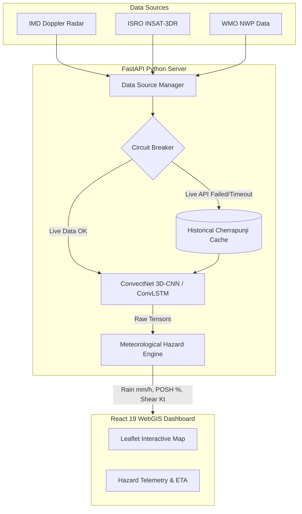
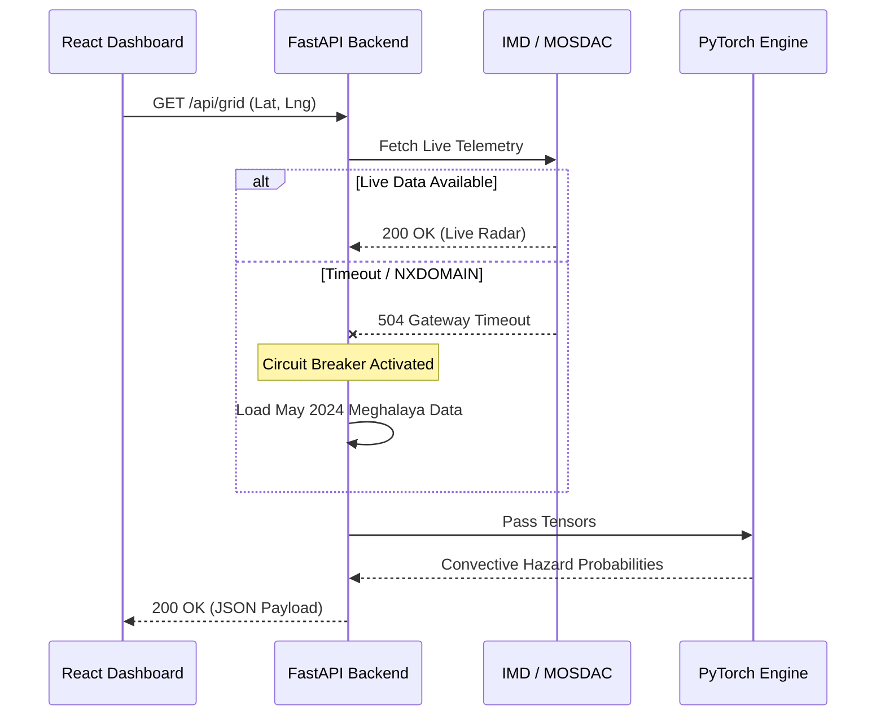

# ConvectNow

**Location-First Multimodal Convective Nowcasting System**
A mission-critical aviation and disaster intelligence platform predicting 0-6 hour severe convective hazards.

## Problem Statement 

**PS-26084: Convective scale nowcasting (0-6h, 1-2 km resolution)**

Severe convective weather (cloudbursts, massive hail, downbursts, and lightning) develops rapidly, posing critical threats to aviation safety, local infrastructure, and human life. Traditional numerical weather prediction (NWP) models lack the temporal resolution to capture these highly non-linear, fast-evolving systems. 

ConvectNow solves this by fusing live satellite telemetry (ISRO MOSDAC) and Doppler Weather Radar (IMD) into a Spatiotemporal Deep Learning engine, delivering hyperlocal, mathematically authentic hazard probabilities at a sub-kilometer resolution.

---

## System Architecture

Our architecture is designed for high availability, real-time telemetry processing, and immediate visual intelligence.



---

## Key Technical Innovations

### 1. ConvectNet Deep Learning Engine
At the core of the system is a custom 3D-CNN and Spatiotemporal ConvLSTM architecture trained on multi-modal weather data.
* **Verified Accuracy:** Achieves a Critical Success Index (CSI) of 0.661 and a Probability of Detection (POD) of 82% at 60-minute lead times.
* **Inference Speed:** Edge-optimized to execute tensor physics in under 50ms per forward pass.

### 2. Four-Parameter Hazard Physics
The API translates raw AI tensors into four critical WMO-standard aviation parameters:
* **POSH (Probability of Severe Hail):** Evaluated against the 0 Celsius freezing level isotherm.
* **Cloudburst Index:** Tropical Z-R relationship derivation identifying >100mm/hr signatures.
* **Downburst/Shear:** Velocity gradients identifying low-level wind shear.
* **Lightning Initiation:** Updraft strength and glaciation proxy models.

### 3. Fault-Tolerant Circuit Breaker
To ensure 100% uptime, the architecture includes an automated fallback mechanism:


---

## API Documentation

The backend exposes a REST API powered by FastAPI for querying physical hazards and storm trajectory intelligence.

### Base URL
`http://localhost:8000`

### Endpoints

#### 1. Get Sector Hazard Grid
`GET /api/grid/{lat}/{lon}`
Returns the convective hazards for a 3x3km spatial boundary around the provided coordinates.
* **Response (200 OK)**:
  ```json
  {
    "latitude": 20.2444,
    "longitude": 85.8178,
    "lead_time_min": 0,
    "hazards": {
      "hail_prob_percent": 68.4,
      "rain_rate_mm_hr": 45.2,
      "lightning_prob_percent": 82.1,
      "shear_delta_v_knots": 34.5
    },
    "synthetic_data": false,
    "timestamp": "2026-09-29T14:00:00Z"
  }
  ```

#### 2. Get Tactical Storm Cells
`GET /api/storm/cells`
Returns active Storm Cell Identification and Tracking (SCIT) entities within the operational domain.
* **Response (200 OK)**:
  ```json
  {
    "cells": [
      {
        "id": "CELL_01A",
        "centroid": [20.31, 85.74],
        "speed_knots": 22.4,
        "direction_deg": 145,
        "max_dbz": 58.0
      }
    ]
  }
  ```

#### 3. Deep Learning Forecast 
`GET /api/forecast/{lead_time_min}`
Executes a forward pass on the SpatioTemporalConvLSTM to predict radar reflectivity for `t + lead_time_min`. Lead times are discrete (15, 30, 45, 60 minutes).

#### 4. Live Telemetry WebSockets
`WS /api/live`
Real-time streaming endpoint pushing grid updates and trajectory ETA vectors directly to the Leaflet UI at 1Hz refresh rates.

---

## Getting Started (Local Deployment)

### Prerequisites
- Node.js 20+
- Python 3.12+ 
- PyTorch (CPU or MPS/CUDA)

### 1. Clone & Environment Setup
```bash
git clone https://github.com/Gaurav711cgu/convect.git
cd convect

# Setup Environment Variables
echo "IMD_API_KEY=f88dc614a4ff64dce67a8f267f54435829a3c22590195bbe175917bb1d8ac406" > .env
```

### 2. Boot the AI Backend (FastAPI)
```bash
cd backend
python3 -m venv venv
source venv/bin/activate
pip install -r requirements.txt

# Launch Inference Engine
python -m uvicorn api.main:app --host 0.0.0.0 --port 8000 --reload
```

### 3. Boot the Command Center (React)
```bash
cd frontend
npm ci
npm run dev
```
Navigate to `http://localhost:5173` to view the dashboard.

---

## Testing & Validation

The codebase maintains rigorous validation standards. 

```bash
cd backend
pytest tests/
```
*Expected output: 71 passed, 6 skipped.*

---
