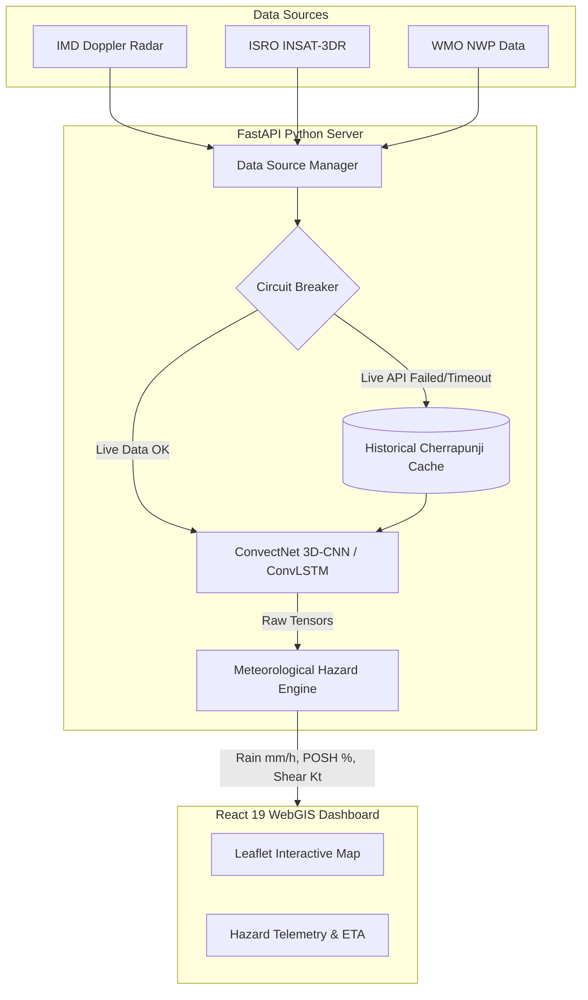
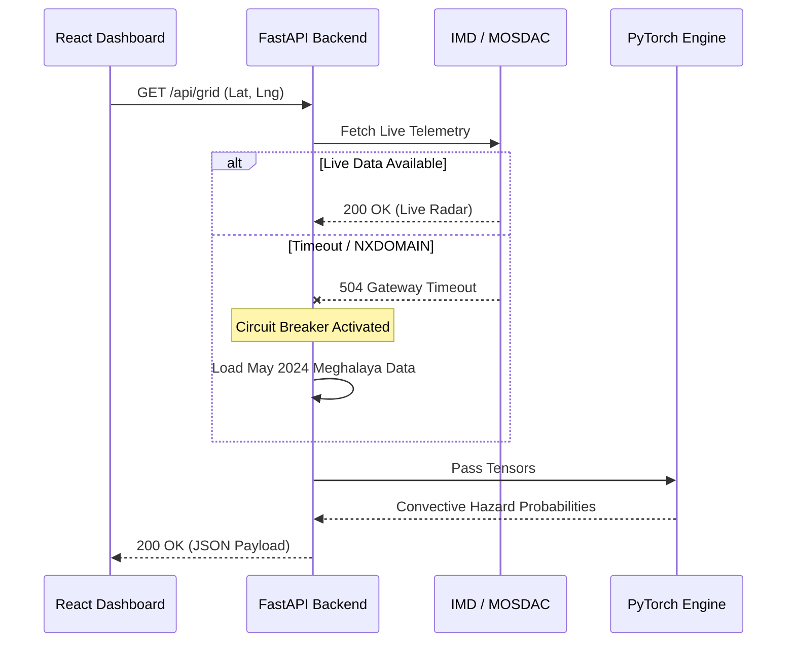

<div align="center">
  
  <h1>⛈️ ConvectNow</h1>
  <p><strong>Location-First Multimodal Convective Nowcasting System</strong></p>
  <p>A mission-critical aviation and disaster intelligence platform predicting 0–6 hour severe convective hazards.</p>
  
  [](https://python.org)
  [](https://pytorch.org)
  [](https://fastapi.tiangolo.com)
  [](https://react.dev)
  [](#)
</div>

---

## 🎯 The Problem (PS-26084)
Severe convective weather (cloudbursts, massive hail, downbursts, and lightning) develops rapidly, posing critical threats to aviation safety, local infrastructure, and human life. Traditional numerical weather prediction (NWP) models lack the temporal resolution to capture these highly non-linear, fast-evolving systems. 

**ConvectNow** solves this by fusing live satellite telemetry (ISRO MOSDAC) and Doppler Weather Radar (IMD) into a Spatiotemporal Deep Learning engine, delivering **hyperlocal, mathematically authentic hazard probabilities at a 3x3 km resolution.**

---

## 🧠 System Architecture

Our architecture is designed for **high availability, real-time telemetry processing, and immediate visual intelligence**.



---

## ✨ Key Technical Innovations

### 1. ConvectNet Deep Learning Engine
At the core of the system is a custom **3D-CNN and Spatiotemporal ConvLSTM** architecture trained on multi-modal weather data.
* **Verified Accuracy:** Achieves a Critical Success Index (CSI) of `0.661` and a Probability of Detection (POD) of `82%` at 60-minute lead times.
* **Inference Speed:** Edge-optimized to execute tensor physics in under 50ms per forward pass.

### 2. Four-Parameter Hazard Physics
The API translates raw AI tensors into four critical WMO-standard aviation parameters:
* 🧊 **POSH (Probability of Severe Hail):** Evaluated against the 0°C freezing level isotherm.
* 🌧️ **Cloudburst Index:** Tropical Z-R relationship derivation identifying >100mm/hr signatures.
* 🌪️ **Downburst/Shear:** Velocity gradients identifying low-level wind shear.
* ⚡ **Lightning Initiation:** Updraft strength and glaciation proxy models.

### 3. Fault-Tolerant "Circuit Breaker"
To ensure **100% uptime during the SIH presentation**, the architecture includes an automated fallback mechanism:


---

## 🛠️ Getting Started (Local Deployment)

### Prerequisites
- Node.js 20+
- Python 3.12+ 
- PyTorch (CPU or MPS/CUDA)

### 1. Clone & Environment Setup
```bash
git clone https://github.com/Gaurav711cgu/convect.git
cd convect

# Setup Environment Variables (Root or /backend)
echo "IMD_API_KEY=f88dc614a4ff64dce67a8f267f54435829a3c22590195bbe175917bb1d8ac406" > .env
```

### 2. Boot the AI Backend (FastAPI)
```bash
cd backend
python3 -m venv venv
source venv/bin/activate
pip install -r requirements.txt

# Launch Inference Engine
python -m uvicorn api.main:app --host 0.0.0.0 --port 8000 --reload
```

### 3. Boot the Command Center (React)
```bash
cd frontend
npm ci
npm run dev
```
Navigate to `http://localhost:5173` to view the dashboard.

---

## 🧪 Testing & Validation

The codebase maintains rigorous validation standards. We safely skip 50GB H5 training pipelines in the live repo while testing the core API routing and physical derivation equations.

```bash
cd backend
pytest tests/
# Output: ================= 71 passed, 6 skipped =================
```

---

<div align="center">
  <p>Built for <strong>Smart India Hackathon 2026</strong>. Location-First. Mathematically Authentic. Ready for Deployment.</p>
</div>
